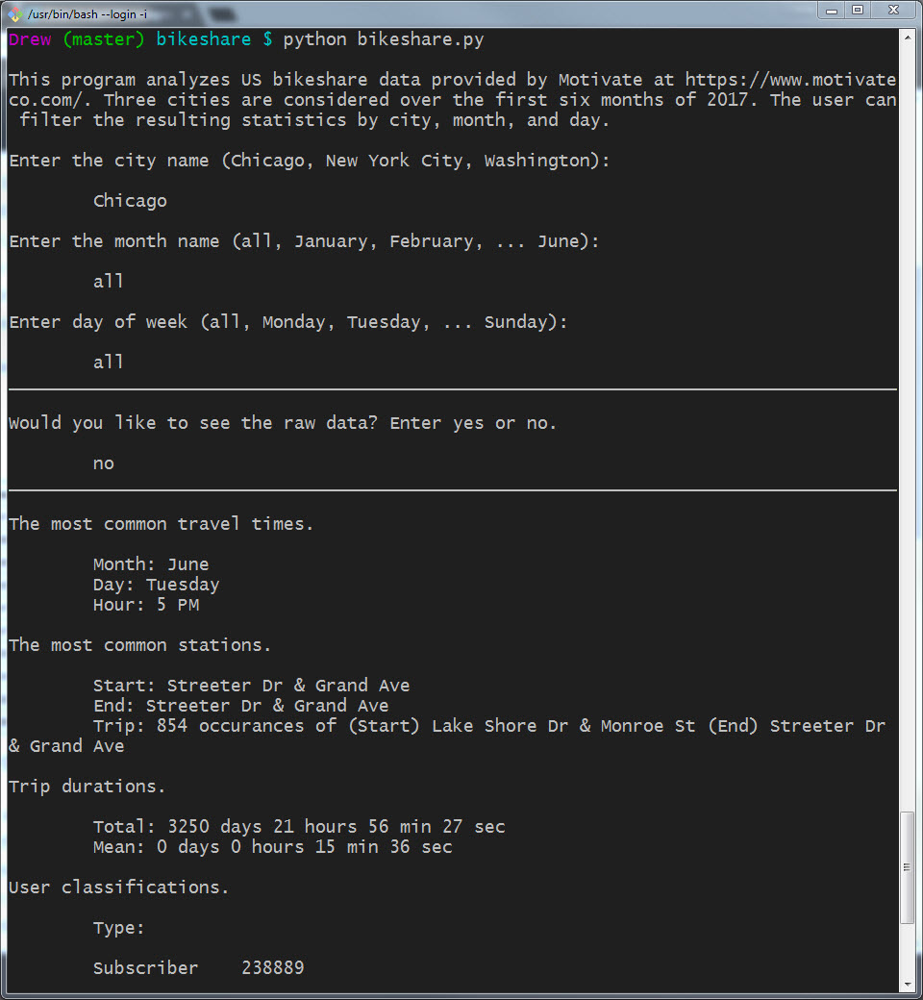

# Bikeshare

This is a command line interface application written in Python 3 that analyzes bikeshare data from three US cities, created as part of the [Data Analyst Nanodegree by Udacity](https://www.udacity.com/course/data-analyst-nanodegree--nd002). The user can filter the summary statistics by city, month, and day.

#### An interactive terminal written in Python 3.

